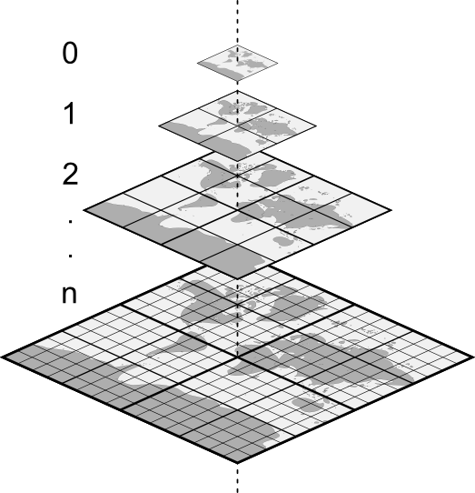
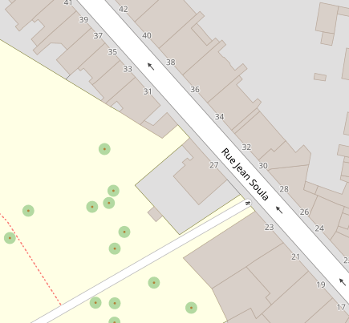
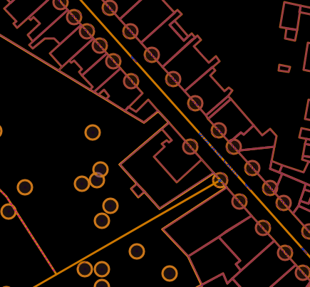

# Démystifions les tuiles vectorielles

## SotM FR 2023

Frédéric Rodrigo - Teritorio

frederic@teritorio.fr

---

## Tuiles

- Carré, bout de carte
- Subdivision récursive

 

---

## Raster

- Dessin, tuiles image (png, jpeg, webp)
- Rendu coté serveur
- Limité a des incréments de zoom

 

---

## Vecteur

- Données, géométries, attributs
- Style appliqué coté client
- Zooms intermédiaires
- Overzoom, affichage correct à un zoom infini, z14+
- Accès aux données

 

----

### Schéma des tuiles

- Données -> Tuiles images (PNG)
- Données -> Tuiles vectorielles (MVT) (-> Tuiles images)

Étape intermédiaire
- Schéma intermédiaire de données
- Mise en cache pour tous les styles

----

### Structure

Fichiers binaires MVT/PBF

- Couches de donnes
- Géométries : point, linge, polygone
- Attributs, clé-valeurs
- Stockage uniquement des attributs présents
- Grille entières à coordonnées relatives

[Spécification MVT](https://docs.mapbox.com/vector-tiles/specification/)

---

## Fournisseurs de tuiles

* Mapbox : schéma Mapbox©
* Maptiler : schéma OpenMapTiles
* JawgMaps : schéma OpenMapTiles
* Geobarik (new) : schéma Shortbread
* Teritorio : schéma OpenMapTiles avec ajouts
* IGN : schéma IGN
* ...
* toi et moi : schéma que l'on veut (mais pas Mapbox©)

---

## Produire des tuiles

- Données personnalisées statiques
  - QGis
  - Tippecanoe
- Dynamique : Postserv, Postile, Tilekiln, T-rex, Tegola, pg_tileserv, Martin...
- OSM statique
  - [OpenMapTiles](https://github.com/openmaptiles/openmaptiles) : schéma [OpenMapTiles](https://openmaptiles.org/schema/)
  - [Planetiler](https://github.com/openmaptiles/planetiler-openmaptiles) : schéma OpenMapTiles
  - [Tilemaker](https://github.com/systemed/tilemaker)
    - schéma OpenMapTiles
    - schéma [Shortbread](https://shortbread.geofabrik.de/schema/1.0/)

---

## Servir des tuiles

- [TileJSON](https://github.com/mapbox/tilejson-spec)
    - Descripteur de service de tuiles
    - [Attribution](https://vecto.teritorio.xyz/styles/openstreetmap-carto/style.json)
- MBTiles : tileserver-gl...
- PMTiles : besoin de rien

---

## Styles

Styles standards de base :
- « Street »
- Colorée
- Activité d’extérieur
- Blanc & Noir
- Nuit
- ...

Galerie https://vecto-dev.teritorio.xyz/

Les styles ne sont pas compatibles entre schéma.

---

## Afficher des tuiles

- MapLibre/Mapbox GL
  - [MapLibre GL JS](https://maplibre.org/maplibre-gl-js-docs/api/) / [Mapbox GL JS](https://docs.mapbox.com/mapbox-gl-js/api/) (Web)
  - [MapLibre GL Native](https://github.com/maplibre/maplibre-gl-native) / [Mapbox GL Native](https://github.com/mapbox/mapbox-gl-native) (PC, Mobile)
- [OpenLayer](https://openlayers.org/)
- Leaflet (solution déconseillé)
  - [Leaflet](https://leafletjs.com/) + [Mapbox GL Leaflet](https://github.com/mapbox/mapbox-gl-leaflet)
  - [Leaflet](https://leafletjs.com/) + [Leaflet.VectorGrid](https://github.com/Leaflet/Leaflet.VectorGrid) (très partiel)
- QGis

---

## Possibilités

- Multilingues
- Frontières alternatives

- Interrogation des données
- Interactivité

- Zooms intermédiaires, Overzoom
- Rotation, inclinaison
- 3D
- Ombrage dynamique, Terrain 3D

---

<iframe src="https://teritorio.github.io/teritorio-map/demo-fr.html#5.03/46.1/0.62" width="90%" height="700"></iframe>

---

## Maputnik

### L'édition de style coté client

https://maputnik.github.io/

- Utilisation de tuiles distantes
- Accès direct aux propriétés des calques
- Inspecteur

---

### Pour le contributeur ?

- Pas de mise à jour par diff,
  - mais recalcul rapide
  - max z14 + overzoom
- Pas de schéma avec tout

 
 

### OSM Carto (aka Mapnik) ?

- plusieurs copies : [Geofabrik](https://github.com/geofabrik/openstreetmap-carto-vector-tiles), [OpenMaptTiles](https://vecto-dev.teritorio.xyz/styles/osm-openmaptiles-gl-style/?vector#15.35/43.295265/5.365322)
- mais pas l'original, longue préparation du style et des outils

---

##  Conclusion

- Mieux que le raster
  - Plus rapide à produire
  - Plus simple à produire
  - Viens avec l'attribution
  - Édition de styles sans données
  - Plus de possibilité, multilingue, interaction...
  - Plus léger
- Mois
  - Tuiles vecto à adapter pour des usages spécifiques
  - Pas de mise à jour par diff
